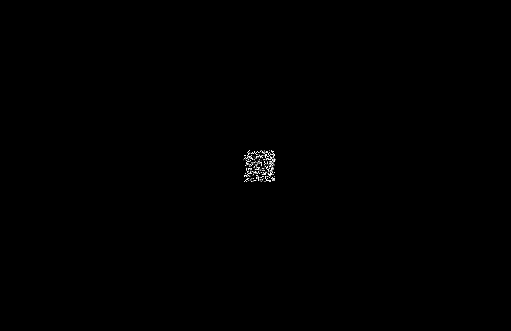

---

## Studio Knowledge Object

### [Week 01 - New Beginnings ](https://fergarundel.github.io/CODE-WORDS/week_01/)
### [Week 02 - Modular](https://fergarundel.github.io/CODE-WORDS/week_02/)
### [Week 03 - Electronic Literature](https://fergarundel.github.io/CODE-WORDS/week_03/)
### [Week 04 - Spinning Words](https://fergarundel.github.io/CODE-WORDS/week_04/)
### [Week 05 - Club Penguin and Beuys](https://fergarundel.github.io/CODE-WORDS/week_05/)
### [Week 06 - Exploration and Experimentation](https://fergarundel.github.io/CODE-WORDS/week_06/)
### [Week 07 - Mid-Semester Break](https://fergarundel.github.io/CODE-WORDS/week_07/)
### [Week 08 - Visualisation](https://fergarundel.github.io/CODE-WORDS/week_08/)
### [Week 09 - TextToPoints()](https://fergarundel.github.io/CODE-WORDS/week_09/)
### [Week 10 - Work in Progress](https://fergarundel.github.io/CODE-WORDS/week_10/)
### [Week 11 - Email Threads](https://fergarundel.github.io/CODE-WORDS/week_11/)
### [Week 12 - Final Presentations](https://fergarundel.github.io/CODE-WORDS/week_12/)

---
## Final Outcome

### [Free International University](https://fergarundel.github.io/CODE-WORDS/week_12/cells_final/)

---

