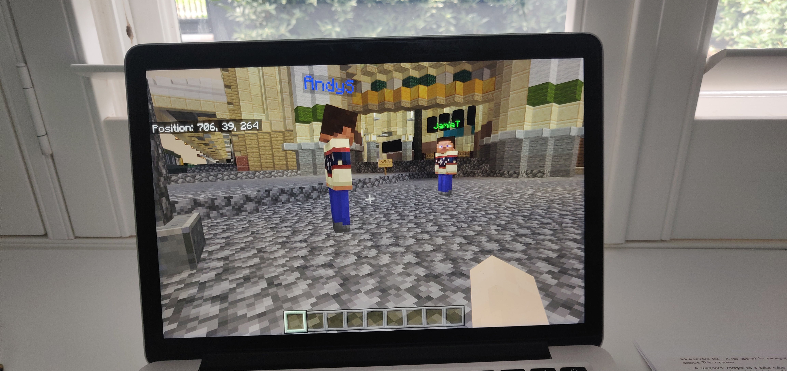
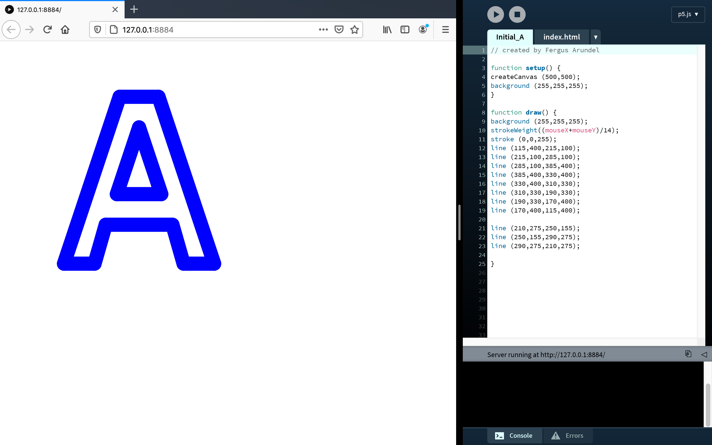

# New Beginnings - Week 01
## Virtual Melbourne 
 
As an introduction to the course we we're invited into virtual Melbourne in Minecraft where we discussed the future of reading in the digital age as well as the increasing popularity of virtual worlds partly due to the COVID-19 pandemic.
## Initial (A) Sketch
 
After playing around with Processing and p5.js for the first time and experimenting with the mouseX and mouseY variables I created an [*interactive design*](https://fergarundel.github.io/CODE-WORDS/week_01/Initial_A/) (A) using lines and strokeWeight. I found it really fun playing around with the software for the first time and am looking forward to exploring what else I can create.

