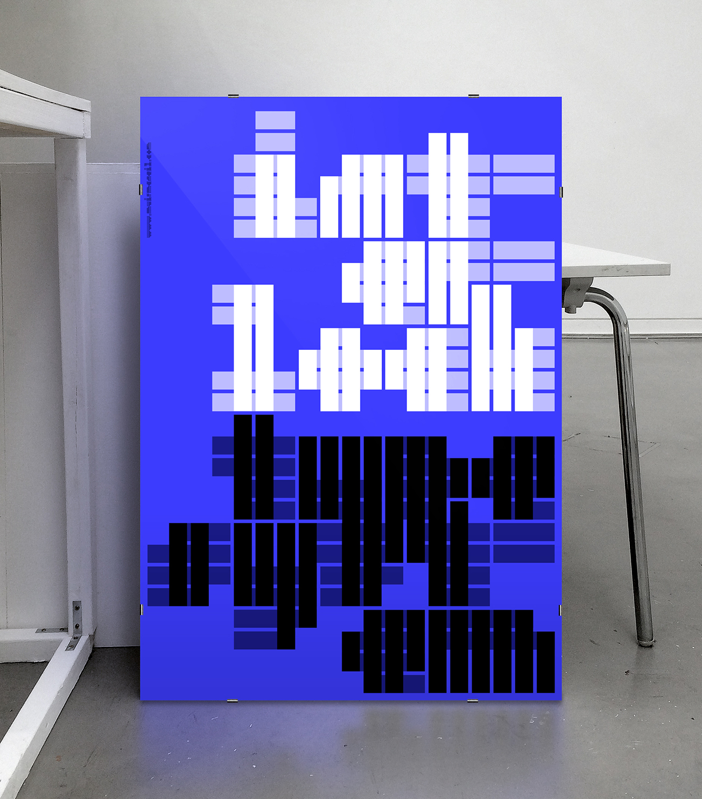

# Modular - Week 02
## Modular Typefaces

Above is [*MuirMcneil's Interlock*](https://muirmcneil.com/project/interlock-type-system/), a modular typeface created using only vertical or horizontal lines. “In Interlock, a common grid determines the positioning of all elements with every contour and space aligning precisely. Interlock typefaces are designed to interact in layers with one another and with corresponding sets of rectangular background grids.” This week we researched modular typefaces creating a google slide [*google slide*](https://docs.google.com/presentation/d/1N2hAFp6si7UsVuPj1oMQ21_HHF858NbXZna0YQxOQio/edit#slide=id.p) with the classes favourites. It will be interesting to see how this will be incorporated into our major project later in the semester.
## Assignment 2: Re-Readings

This week we also started to organise ourselves for Assignment 2, splitting into groups and choosing which passage of [*House of Leaves*](https://en.wikipedia.org/wiki/House_of_Leaves) we will be interpreting in the virtual world. For my group (Hamish, Celia, Ruby and Myself) we chose Club Penguin, partly for nostolgic reasons and party to see how the horror genre can translate to such a kid friendly environment.

---

### [[Previous Week]](https://fergarundel.github.io/CODE-WORDS/week_01/) - [[Next Week]](https://fergarundel.github.io/CODE-WORDS/week_03/)
