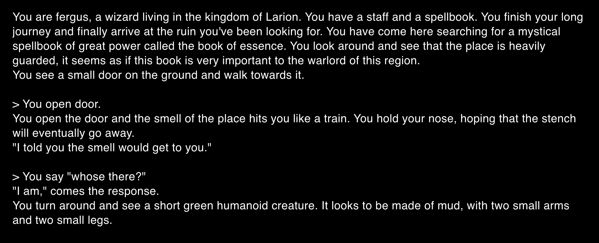
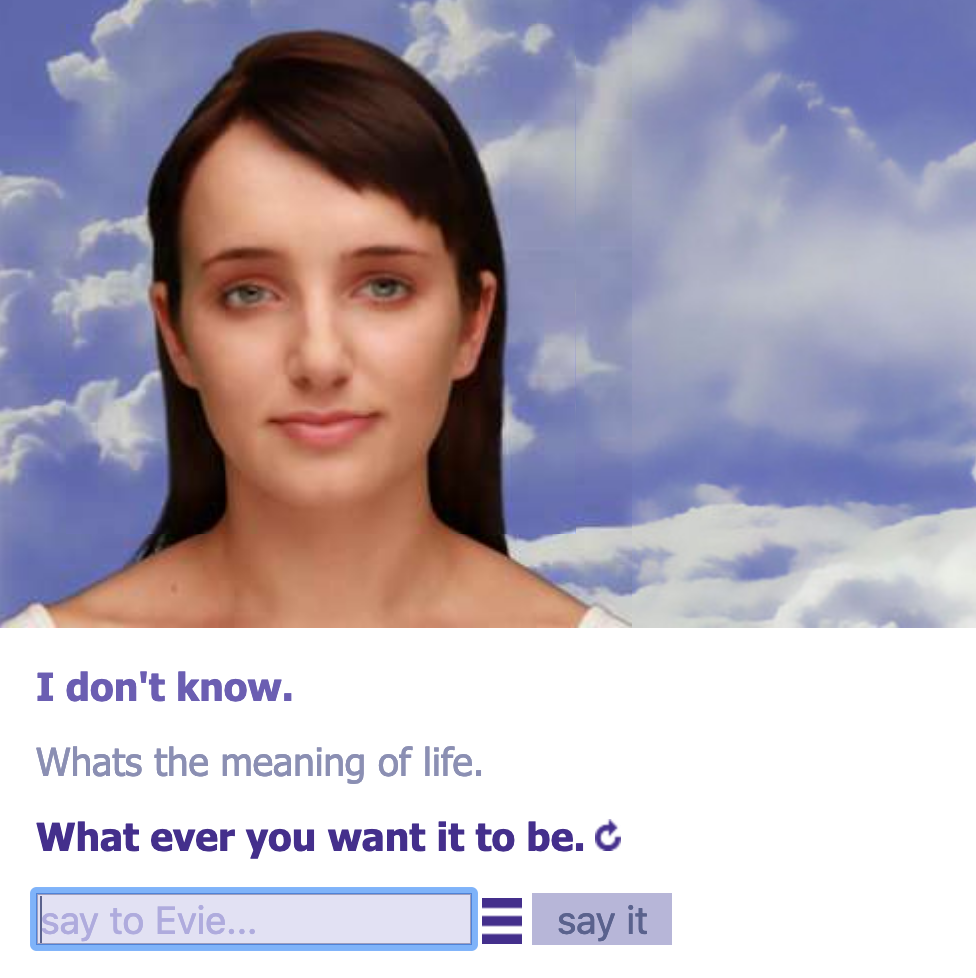

# Electronic Literature - Week 03
## AI Dungeon 

This week we began to explore [*Electronic Literature*](https://en.wikipedia.org/wiki/Electronic_literature), wikipedia describes electronic literature as "a construction whose literary aesthetics emerge from computation", "work that could only exist in the space for which it was developed/written/coded—the digital space". Throughout the class we interacted and created our own narrative in [*AI Dungeon*](https://play.aidungeon.io/), a single-player and multiplayer text adventure game which uses artificial intelligence to generate unlimited content, which ended up getting stuck in an infinite loop after we killed God.
## Evie Bot

Another example of Electronic Literature are bots a "computer program designed to operate autonomously, performing scheduled, responsive, or real-time operations in a computer, through the Internet, and/or on social media networks". Evie Bot is a bot that can answer your questions, unfortunately she hasn't given me a straight forward answer to the meaning of life. It's interesting to think about how close we are to creating bots that are unrecognisable from human intellegence, maybe we already have, and if these technological advancements will be for the benefit of humankind.

### [*Class slides for Electronic Literature*](https://docs.google.com/presentation/d/1QXcxFkKdzMiwNWBSdXT0LG9YNFjlzViwScTtsLMXROo/edit)

---

### [[Previous Week]](https://fergarundel.github.io/CODE-WORDS/week_02/) - [[Next Week]](https://fergarundel.github.io/CODE-WORDS/week_04/)
