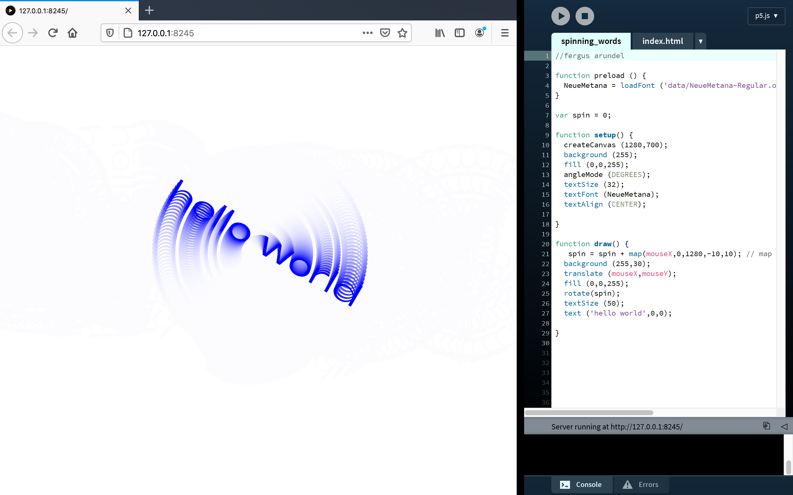
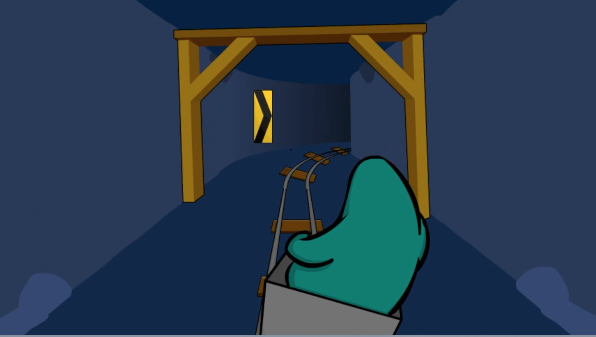

# Spinning Words - Week 04
## Hello World

This week type was introduced to our sketches, using the preload() function we were able to experiment with text for the first time. Like other objects inside the sketch typography can be manipulated and played with, along with the class I rotated the text to create this [*outcome*](https://fergarundel.github.io/CODE-WORDS/week_04/spinning_words/) shown above, have a try yourself.
## Virtual World continued

As a group we continued to experiment with what we can achieve in our virtual world, Club Penguin. We quickly discovered that the world was very limited in what we can customize and create, something that we will have to work with going forward. We came upon the idea of using the ingame minigames to symbolise certain sections of the text such using the minecart game for Johnny's panic attack.
