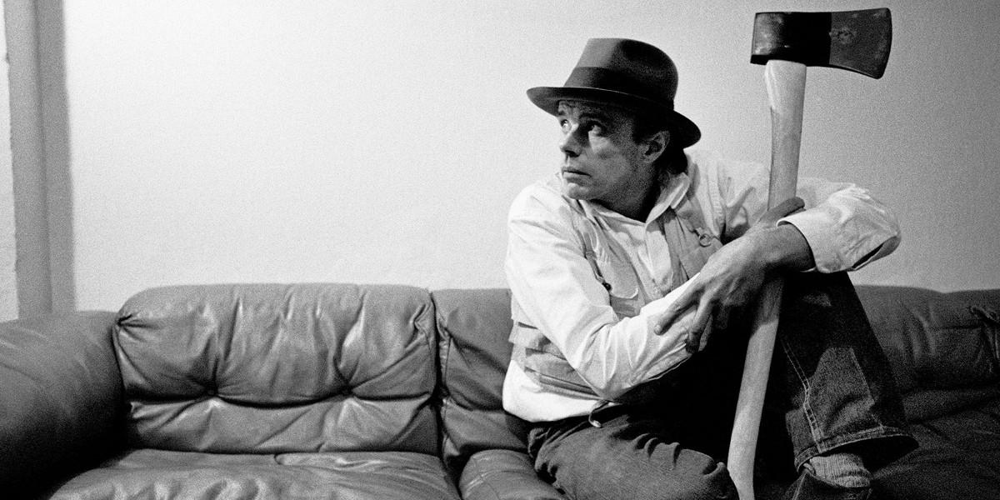
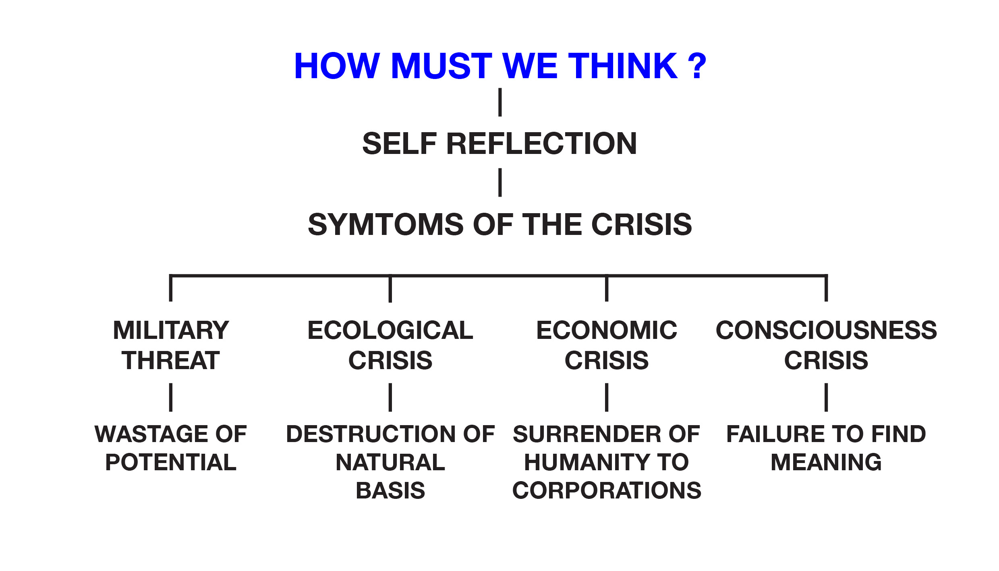

# Club Penguin and Beuys - Week 05
## Assignment 02 Submission
This week we started the class with sharing the rough cut for our Re-Reading videos, it was amazing to see the work everyone had put into their videos and all the interesting and werid outcomes people managed to create. I was pretty happy with our [*outcome*](https://www.youtube.com/watch?v=hxVLtIr6eNs) too, although in retrospect I would've rathered done the video in a virtual world which allows more creative freedom and control such as Minecraft or Second Life.
## Joseph Beuys - An appeal for an Alternative

Continuing on with the semester I searched the wonderfully curated [*online reader*](http://digbeyond.com/readme/phplist.php?course=Code-Words) for a reading that I will be using for my Major Project. I came across Joseph Bureys [*'An appeal for an Alternative'*](http://digbeyond.com/readme/view.php?id=61&course=Code%20Words), having a very limited knowledge of Buey's work I was interested in what the essay was about. In Beuy's reading he calls for an extreme transformation of society's traditional structure and highlights the symtoms of the worlds current crisis. Beuys also proposes a radical alternative, *THE THIRD WAY*, which requires a non-violent transformation from Western civilisations Capitalism and Western civilisations Communism. I have summarised the artists appeal below splitting his essay into HOW MUST WE THINK? and WHAT CAN WE DO.

