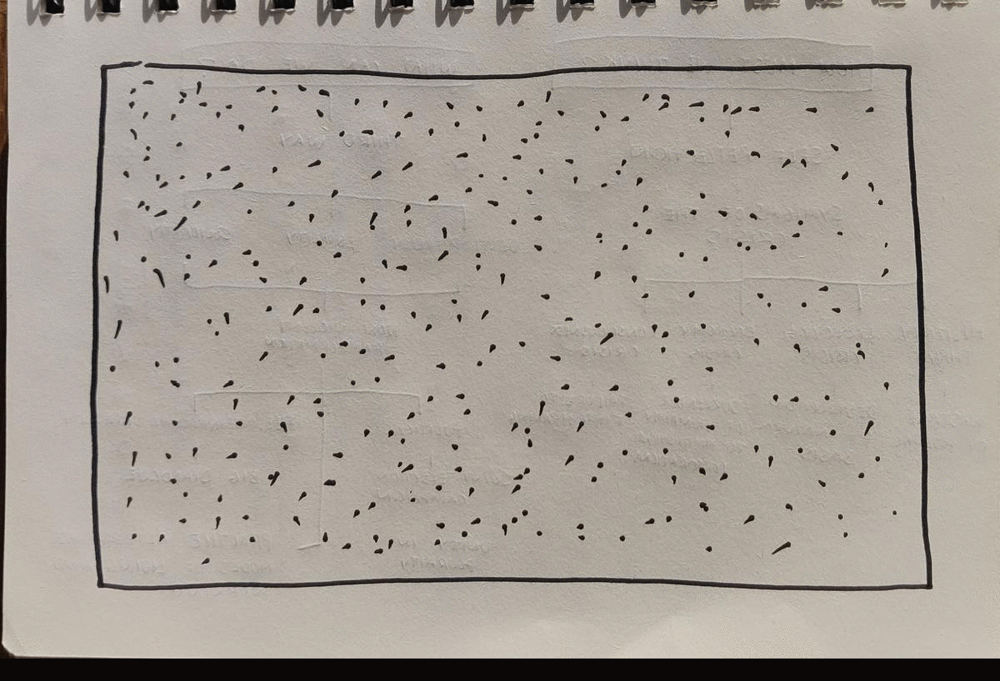

# Mid-Semester Break - Week 07

##  Typography experimentation 

In the break I have started to focus more on typography and ways in which I can create an interesting and interactive design that moves beyond regular digital reading. Using the introduction from Jospeh Beuys' manifesto I have attempted to make a visually compelling [outcome](https://fergarundel.github.io/CODE-WORDS/week_07/flashing_text) which could be further expanded upon in the future using different interactive methods. I know there must be a better way to go about this outcome but for now this example works to give a general idea of the feel of the digital space. To make this passage more readable I could use phrases instead of words, creating a more natural reading pattern.

## Paper Prototyping 
### First Prototype (General Overview)

This prototype/idea for the major assignment revolves around the gerneral ideas of the text and uses the map I created last week to create an interactive 'map' of the text beginning with HOW MUST WE THINK? and WHAT CAN WE DO? then going through the major points of each of the sub-sections. I think this relatively basic idea if executed well could be very visually compelling and immersive. However with the idea being quite basic, the outcome could be relatively boring in terms of what I am able to create with other concepts.

### Second Prototype - FREE INTERNATIONAL UNIVERSITY

With this concepts I have focused on a certain section of the reading, Beuys call for a FREE INTERNATIOAL UNIVERSITY. Beuys states the University to be a place which "includes all the groups and live cells in our society in which people have banded together to think through the questions of the future of our society together". This collective thinking and communication is the key idea behind my second prototype which uses cells formed together to spell out words and sentences from the text, with the canvas beginning with a randomly generated array of cells. This technique will be used together with interactive sound design to create a fully immersive experience for the user. Below are some of the rough sketches I have created to outline this idea.

---

### [[Previous Week]](https://fergarundel.github.io/CODE-WORDS/week_06/) - [[Next Week]](https://fergarundel.github.io/CODE-WORDS/week_08/)

