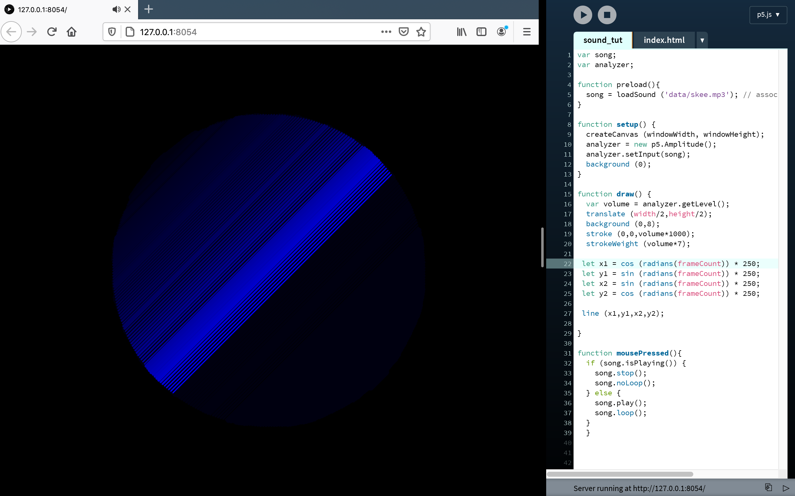
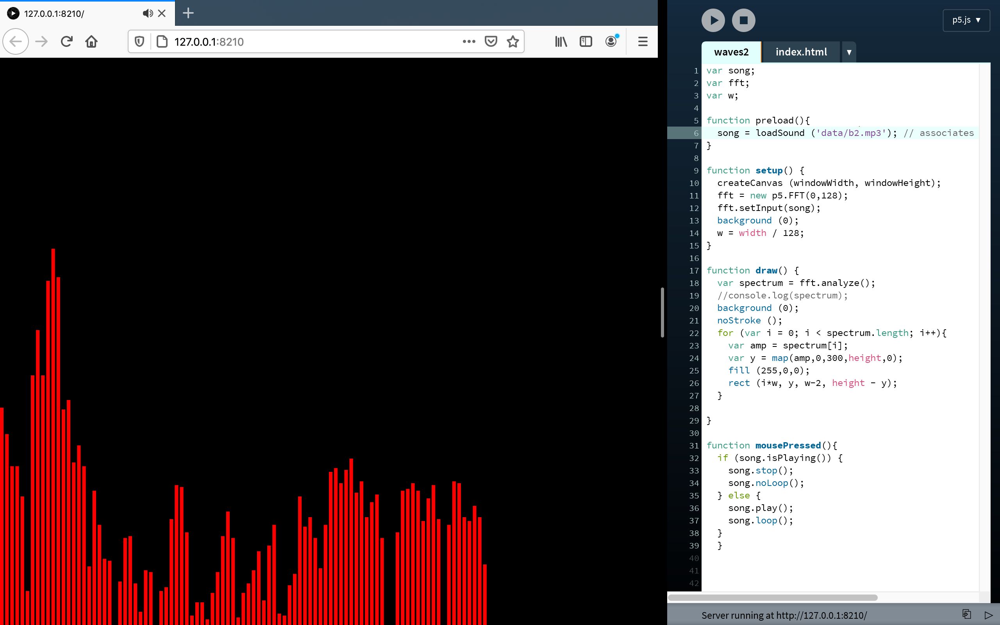

# Visualisation - Week 08
## Level Visualiser

In last weeks class we were shown through how to recieve a input level from a song or song using p5.Amplitude, using this number we were then told to experiment and have fun with it over the next week. I played around with creating a sin wave pattern while using the amplitude of the song, [*Skee Mask - Kozmic Flush*](https://www.youtube.com/watch?v=3zf42fwPnag&ab_channel=ILIANTAPE), to change  the lines thickness and colour to create a hypnotising effect. I think the use of the p5.js sound library will play a major role in my upcoming major assignment mainly to create an immersive atmosphere but I think it would also be interesting to see how else sound can be used to create an interactive experience. You can use the visualiser for yourself [*here*](https://fergarundel.github.io/CODE-WORDS/week_08/waves/).

## Frequency Visualiser

Continuing on from using the Amplitude as a value in my sketch, I explored using FFT, [Fast Fourier transform](https://en.wikipedia.org/wiki/Fast_Fourier_transform), as a method to create visually appealing outcomes. Using a video from [*The Coding Train*](https://www.youtube.com/watch?v=2O3nm0Nvbi4&t=1s&ab_channel=TheCodingTrain) as a template [*my outcome*](https://fergarundel.github.io/CODE-WORDS/week_08/freq/), as shown above, is quite basic and rudimentary in terms of what can be achieved using this function. I will also continue to experiment with this in the future as  a way to create interaction between visual and audio elements.

## Frequency Visualer continued 

Again continuing to use FFT, I merged the ideas of the two sketches to form [*this outcome*](https://fergarundel.github.io/CODE-WORDS/week_08/frequency/) which uses the inputs bass and treble frequency to change the colour of the line, with red being the low frequency sound and blue representing the high range. This creates an interesting affect when paired with the Amplitude value controlling the thickness of the line. Using Github pages I have found that the audio quality of each sketch has been manipulated with an downgraded quite severely, I will have to explore other options in publishing work online which doesn't have this effect on the quality of the outcome.
