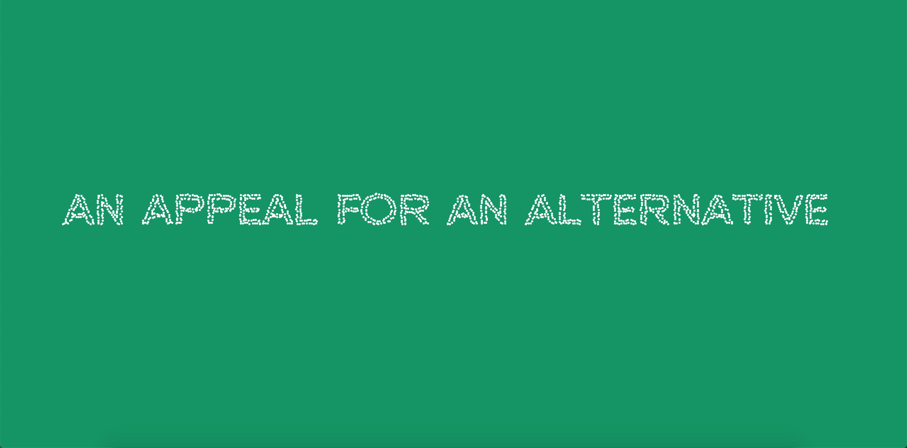

# Work in Progress - Week 09
## Flocking Experimentation
This week I started to have a better look at what is going to form the main structure of my Major Assignment, a flocking system, which moves cells to certain points on the screen to form words and phrases from Joseph Beuys, An Appeal for an Alternative. This is a way of interpretating his call for the Free International University as a place for people to communicate and work through the worlds crises (Military, Ecological, Economic, Consciousness). 

Using The Coding Train's [*video*](https://www.youtube.com/watch?v=4hA7G3gup-4&ab_channel=TheCodingTrain) about steering behaviours as the foundation (as well as [*particle clock*](https://www.openprocessing.org/sketch/448956) of the physics system I created a basic sketch to show the capabilities of the structure. Outcome link [*here*](https://fergarundel.github.io/CODE-WORDS/week_09/cells/). Using the foundation I experimented with making the cells seem more alive and dynamic by giving them a vibrating effect. I am interesting in using libraries, such as p5.particle, as the foundation for the physics system inside the sketch so I can play around with and experiment with the system further.



### Vehicle Class taken from Daniel Shiffman

``` javascript
class Vehicle {
  constructor(x,y){
    this.pos = createVector(random(width),random(height));
    this.target = createVector(x,y);
    this.vel = createVector();
    this.acc = createVector();
    this.maxspeed = 8;
    this.maxforce = 0.3;
  }
 
  behaviours(){
    let arrive = this.arrive(this.target);  
    this.applyForce(arrive);    
  }
  
  
  applyForce(f){
    this.acc.add(f);    
  }
  
  arrive (target){
    let desired = p5.Vector.sub(target,this.pos);
    let d = desired.mag();
    let speed = this.maxspeed;
    if (d<100){
      speed = map(d,0,100,0,this.maxspeed);
    }
    desired.setMag(speed);
    let steer = p5.Vector.sub(desired,this.vel);
    steer.limit(this.maxforce);
    return steer;

  }
  
  update (){
    this.pos.add(this.vel);
    this.vel.add(this.acc);
    this.acc.mult(0);
}

  show (size) {
    stroke (255);
    strokeWeight(size);
    point(this.pos.x+random(-1,1),this.pos.y+random(-1,1));
}
}
```
### Sketch using Vehicle Class

``` javascript
let font;
let vehicles = [];
let text = 'AN APPEAL FOR AN ALTERNATIVE';

function preload(){
  font = loadFont('data/NeueMetana-Regular.otf');
}

function setup() {
  createCanvas (windowWidth,windowHeight);  
  
    var cells = font.textToPoints(text,90,height/2,60,{ 
      sampleFactor: .3,
    });
  
  for (var i = 0;i < cells.length;i++){
    var cell = cells[i];
    var vehicle = new Vehicle(cell.x,cell.y);
    vehicles.push(vehicle);
  }

}


function draw() {
  background(0,150,100);
  
  for (var i =0; i < vehicles.length ;i++){
    var vehicle = vehicles [i];
    vehicle.behaviours();
    vehicle.update();
    vehicle.show(2);
  }
}
```

## Continuing 
With continuing this sketch I will have to find a way make the text change and morph into new phrases, the trouble I am having with this is that the initial phrases, 'An Appeal for an Alternative', is in the setup() function, meaning that updating this I will have to move it into a looping function such as draw(), that allows me to constantly update the position of the cells. 

