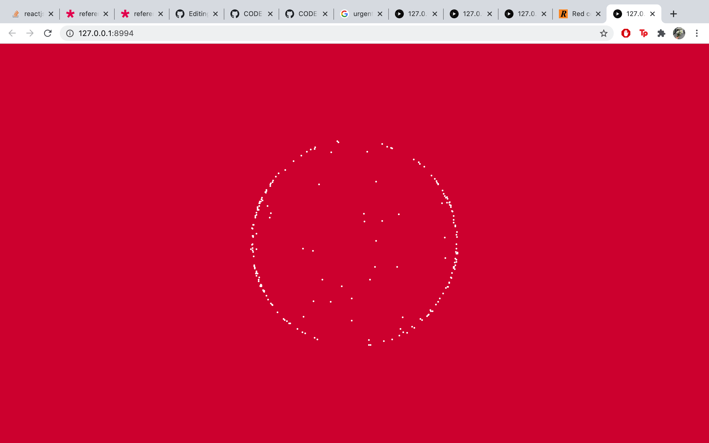
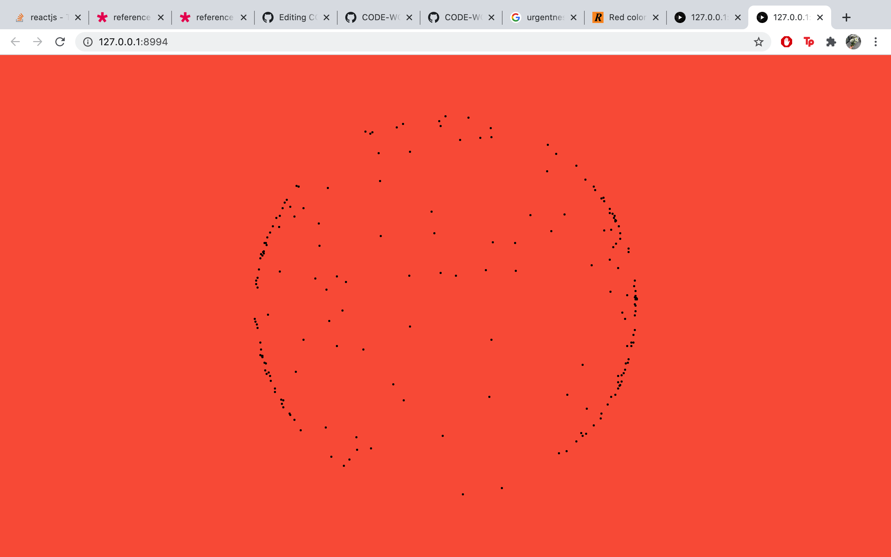
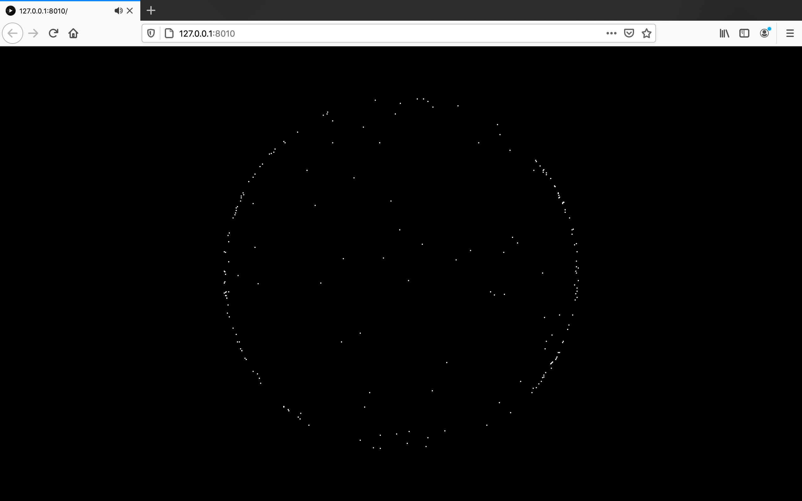

# Work in Progress - Week 10 
## Continuing with Flocking


Last week I began to experiment with a flocking (or steering) system that would allow me to draw a word or phrase out of points using the textToPoints function. This week I continued that experiment to be able to cycle through text using a lot of help from the sketch [*particle clock*](https://www.openprocessing.org/sketch/448956). By either splicing or pushing additional cells into the array I was able create a looping phrase, which I plan to be the beginning of my digital reading. This weeks outcome [*here*](https://fergarundel.github.io/CODE-WORDS/week_10/cells_5/).

### Code added to enable loop

``` javascript
 if (cells.length < vehicles.length){
    vehicles.splice(cells.length -1, vehicles.length - cells.length);
  
  for (let i = 0;i < cells.length; i++){
    vehicles[i].target.x = cells[i].x;
    vehicles[i].target.y = cells[i].y; 
    }
  } else if (cells.length > vehicles.length){
    
    for (let i = vehicles.length; i< cells.length;i++){
      let v = vehicles[i - vehicles.length].clone();
      vehicles.push(v);
    }
    
    for (let i=0; i<cells.length;i++){
      vehicles[i].target.x = cells[i].x;
      vehicles[i].target.y = cells[i].y;
    } 
  } else {
    for (let i = 0; i < cells.length; i++){
      vehicles[i].target.x = cells[i].x;
      vehicles[i].target.y = cells[i].y;
    }
```

Using the frameCount I am able to increase the index every 200 frames, this works alright but can play up if I enter the loop just before the frameCount is a multiple of 200, practically skipping the initial index value of 0. I will look into how to refine this process in the future.

### Timer

``` javascript
 if (frameCount == time * i + time){
      index = index +1;
    }
    if (index > text.length - 1){
    index = 0;  
```

## Styling 

Although I do like how the sketch is looking with the blue and white, the calming aspect of the background colour doesn't fit the urgentness of the reading. Bueys calls for a revolution to the structures of our society and this blue doesn't quite suit that call to arms. Experimenting with different types of red colour combinations I think this will be a better fit for the text. 








Black also gives a very stripped back / atmospheric aesthetic to the sketch and could pair well with the subject matter, especially when accompainied with sound.
