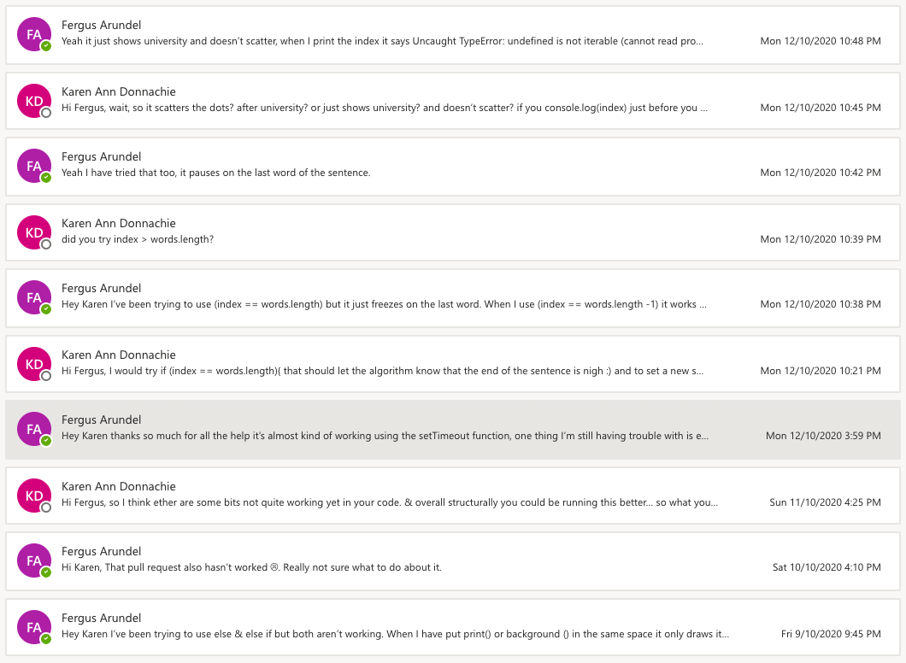
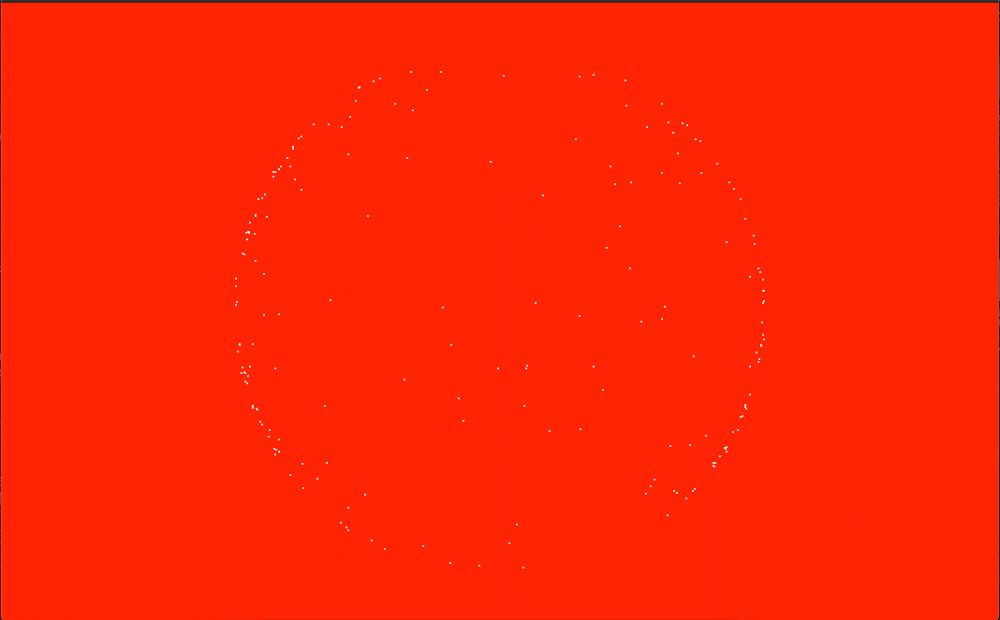

# Email Threads - Week 11



## Trouble with closing loop

Continuing on from last week's sketch I tried to incorporate a function that would send the cells to random locations after they had completed the sentence or once a button is pressed. Unfortunately for Karen, I wasn't 100% sure accomplish this. Begining with the code;

```Javascript 

    if (index > words.length - 1){
    for (let i = 0; i < vehicle.length; i++){
     vehicles[i].target.x = random(width);
     vehicles[i].target.y = random(height);
      }
    }
```

In order to set the cells target x and y at a random width and height. I found this didn't work due to, as Karen put it, an error of logic. As there is no more words in the array, there is no need for cells so they cannot then be moved to random places. After a few more attempts and alot of help from Karen, I tried to implement a settimeout() function which would allow me to only call upon the loopingText function in my code when needed (when cells need to be changed).

Inital setTimeout is called in mousePressed:

```Javascript 
 if (on==false){
   setTimeout (loopingText,0);
   }
   ```
Then another setTimeout is placed in the loopingText function which calls upon the function every 3000 milliseconds:

   ```Javascript
     setTimeout (loopingText,3000);
```
     
As the setTimeout function uses milliseconds to trigger the event I didn't need to rely upon frameCount to change the cells from one word to another. This allowed the cells to be randomised when i triggered the event through mousePressed, I think this works alot better than at the end of the phrase as this allows the user to go through the text at their own pace.



## Troubleshooting

No that I have the overall structure of the work completed I need to start to refine it. Firstly, I'm not happy with how the internal setTimeout calls every 3 seconds without taking into account when the mouse was pressed. As you can see above, if you press the mouse just as the 3 second counter is about to reset the cells it creates an awkward transition. The cells begin to go to random area on the canvas then immediately form the new word without ever reaching the intial random target.  Searching stackoverflow I found a [*solution*](https://stackoverflow.com/questions/1472705/resetting-a-settimeout) to my problem.

```Javascript
 function cycleText (){
   intervalHandle = setInterval(loopingText,3500);
 }
  
 function mousePressed(){  
   timeoutHandle = setTimeout(cycleText,0);
    
   if (on==false){
   timeoutHandle;
   bass.play();
   }
   
   on = true;
   wave.play();
   
   if (on == true){
     
     clearInterval (intervalHandle);
     intervalHandle;
```

Using setTimeout and setInterval as variables allowed me to clear and reset the setInterval on mousePressed meaning that the timing reset once the event is triggered. I used a variation of the stackoverflow code to incorporate the function into my sketch, using the setTimeout to call a new cycleText function which including the setInteravl. This created a much more enjoyable experience when cycling through the text, making every transition identical (shown below). Unfortunately, this made the initial mousePressed go to a random location instead of the first phrase. I will have to refine this further going into next week.


